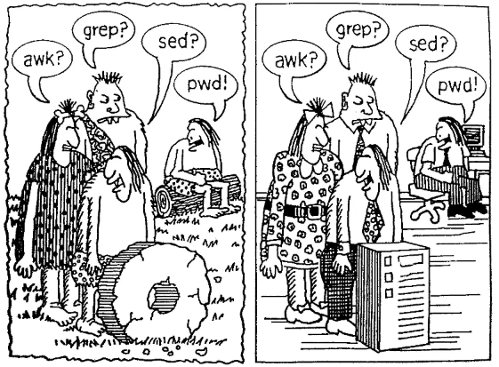

# sed 基本功（Learn sed）

```
sed，Stream EDitor；上古神器；文本处理三剑客；流编辑器
```




## 本仓库内容

1. sed基本功学习笔记

* GitBook:<https://yifengyou.gitbooks.io/learn-sed/content/>
* GitHub:<https://github.com/yifengyou/learn-sed/>
* GitPage:<https://yifengyou.github.io/learn-sed/>

```
Something I hope you know before go into the coding~
First, please watch or star this repo, I'll be more happy if you follow me.
Bug report, questions and discussion are welcome, you can post an issue or pull a request.
```


## 目录

* [sed简介](docs/sed简介.md)
* [sed基本语法](docs/sed基本语法.md)
* [sed标准选项](docs/sed标准选项.md)
* [sed工作原理](docs/sed工作原理.md)


## 参考


* Linux文本三剑客超详细教程 : <https://www.cnblogs.com/along21/p/10366886.html#auto_id_27>

## 小结
